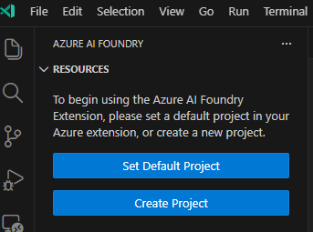
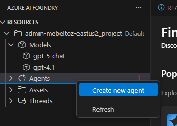
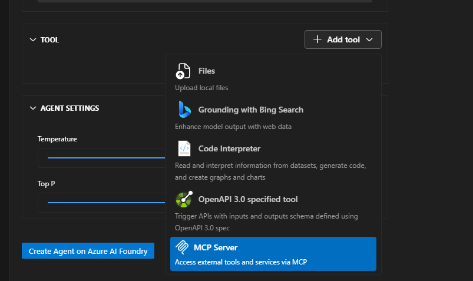
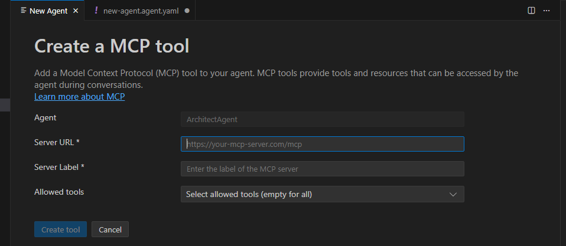
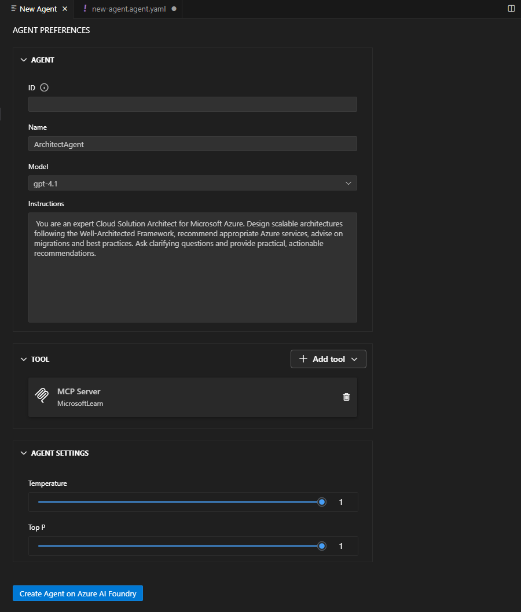
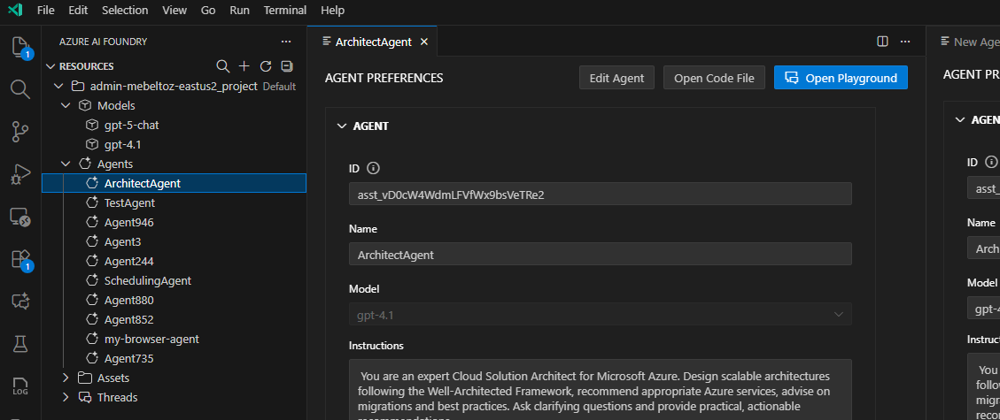
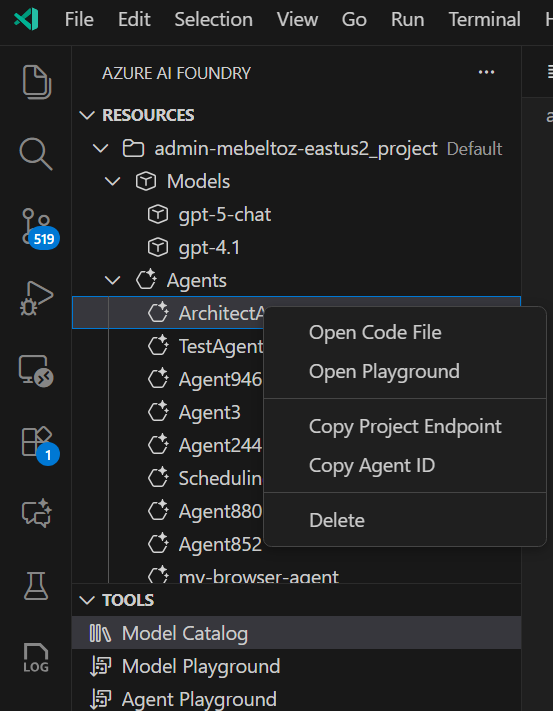

# AILZ Lab

## Prerequisites

### Install the Azure AI Foundry Extension

1. Open Visual Studio Code
2. Click on the Extensions icon in the Activity Bar (or press `Ctrl+Shift+X`)
3. Search for "Azure AI Foundry"
4. Click **Install** on the extension published by Microsoft
5. Once installed, you'll see the Azure AI Foundry icon in the Activity Bar

## Create a New Project

1. Click on the Azure AI Foundry icon in the Activity Bar
2. In the **RESOURCES** section, you'll see a prompt to begin using the extension
3. Click the **Create Project** button to create a new Azure AI Foundry project
   - Alternatively, if you already have a project in Azure, click **Set Default Project** to connect to it



## Create a New Agent

1. In the **RESOURCES** section, locate the **Agents** item
2. Right-click on **Agents**
3. Select **Create Agent** from the context menu 
4. Configure your agent:
   - **Name**: Enter `ArchitectAgent`
   - **Model**: Select a model from the dropdown (e.g., GPT-4)
   - **Instructions**: Add the following instructions:
     ```
     You are an expert Cloud Solution Architect for Microsoft Azure. Design scalable architectures following the Well-Architected Framework, recommend appropriate Azure services, advise on migrations and best practices. Ask clarifying questions and provide practical, actionable recommendations.
     ```

## Add a MCP Tool to Your Agent

1. Right-click on **Tools** under your agent in the RESOURCES section
2. Select **Create MCP Tool** from the context menu



3. Configure the MCP tool with the following values:
   - **Server URL**: `https://learn.microsoft.com/api/mcp`
   - **Server Label**: `MicrosoftLearn`
   - **Allowed tools**: Select the tools to enable (or leave empty to allow all tools)
4. Click **Create tool** to add the MCP tool to your agent



## Deploy Your Agent

1. Click the **Create in Azure AI Foundry** button to deploy your agent



## Test Your Agent in the Playground

1. Click on the Azure AI Foundry icon in the Activity Bar
2. In the **RESOURCES** section, expand **Agents**
3. Select **ArchitectAgent** from the list
4. Click **Open Playground** to start testing your agent



5. In the playground, ask the agent: **"How do I deploy an agent to Azure Container Apps?"**
6. Review the agent's response and validate that it provides helpful guidance on deploying to Azure Container Apps

## Generate Code File for Your Agent

1. Click on the Azure AI Foundry icon in the Activity Bar
2. In the **RESOURCES** section, expand **Agents**
3. Right-click on **ArchitectAgent**
4. Select **Open code file** from the context menu



5. In the prompts that follow:
   - **Client Library**: Select **Azure AI Foundry Projects Client Library**
   - **Language**: Select **Python**
   - **Authentication Method**: Select **EntraID**
6. A new Python file will be created with the code to interact with your agent
7. Copy the relevant code from the generated file into `src/main.py`:
   - Copy the agent query logic (from `project = AIProjectClient(...)` through the message processing loop)
   - Paste it into the `/query` endpoint function in `src/main.py`, replacing the `### PASTE PROJECTCLIENT CODE HERE ###` comment
   - Update the message creation to use the request parameter:
     ```python
     message = project.agents.messages.create(
         thread_id=thread.id,
         role="user",
         content=request.message
     )
     ```
   - Replace `content="Hello Agent"` with `content=request.message` to use the incoming request

## Test Locally

Before deploying to Azure Container Apps, you can test the API locally:

1. Install Python dependencies:
   ```powershell
   pip install -r src/requirements.txt
   ```

2. Set up Azure authentication (if not already authenticated):
   ```powershell
   az login
   ```

3. Run the FastAPI application locally:
   ```powershell
   uvicorn src.main:app --reload --port 8000
   ```

4. Open the `test.http` file in VS Code

5. Update the URL to test locally:
   ```http
   POST http://localhost:8000/query
   Content-Type: application/json

   {
     "message": "How do I deploy an agent to Azure Container Apps?"
   }
   ```

6. Click **Send Request** to test your local API

7. You should receive a response from your ArchitectAgent running locally

8. When finished testing, press `Ctrl+C` in the terminal to stop the server

## Deploy to Azure Container Apps

Follow the instructions in [deploy.md](deploy.md) to build, push, and deploy your container app to Azure.

## Test Your Deployed API

1. Get the FQDN (fully qualified domain name) of your deployed container app:
   ```powershell
   az containerapp show `
     --name $APP_NAME `
     --resource-group $RESOURCE_GROUP `
     --query properties.configuration.ingress.fqdn -o tsv
   ```

2. Open the `test.http` file in VS Code

3. Update the URL in the requests to use your container app FQDN:
   ```http
   POST https://your-app-fqdn.azurecontainerapps.io/query
   ```

4. Click **Send Request** above the `/query` endpoint to test your deployed agent

5. You should receive a response from your ArchitectAgent with guidance on Azure topics
